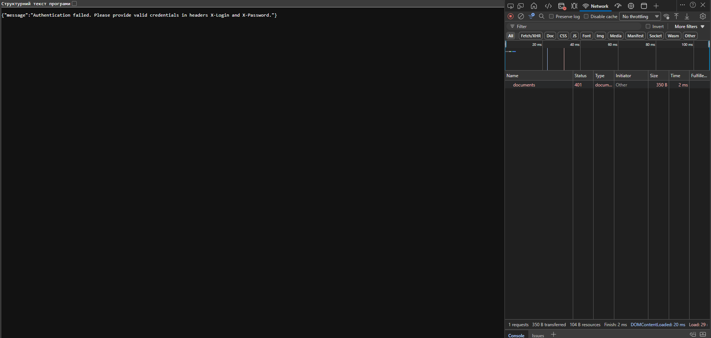
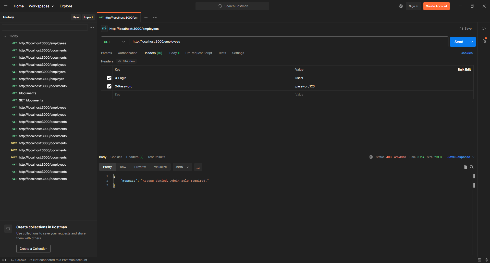
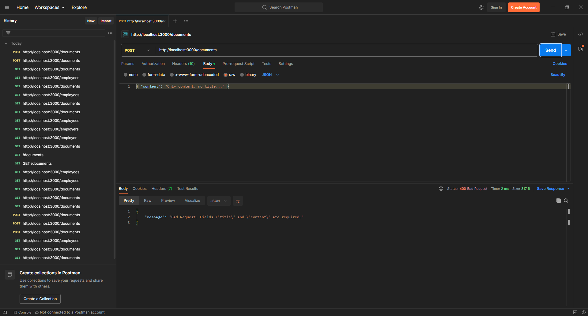
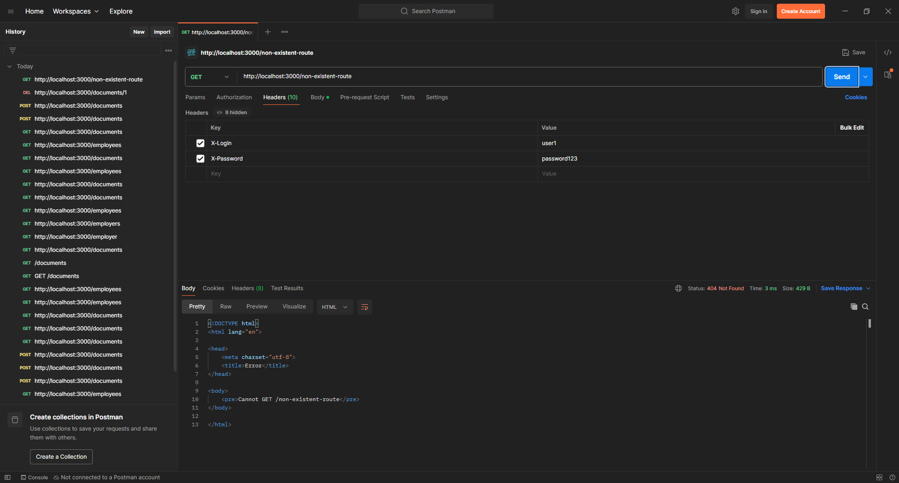
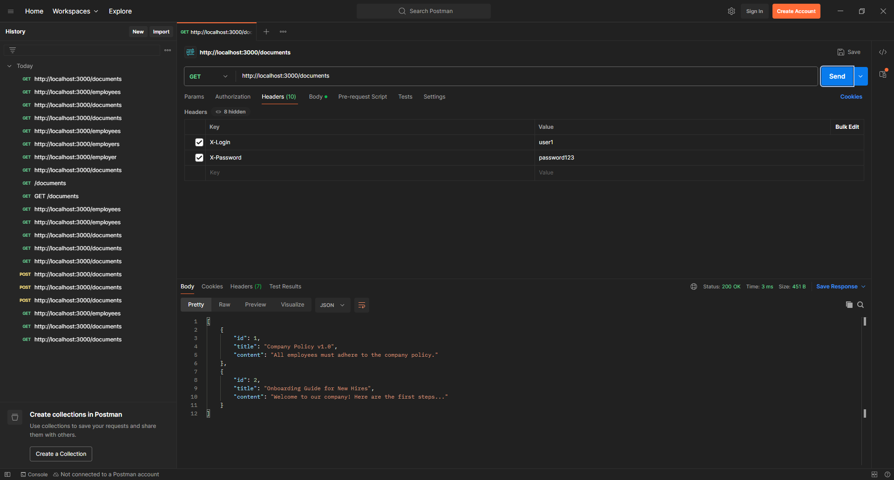
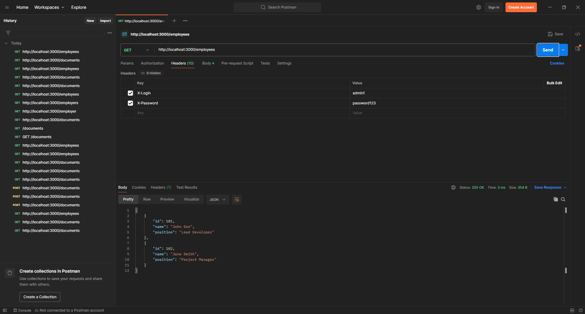
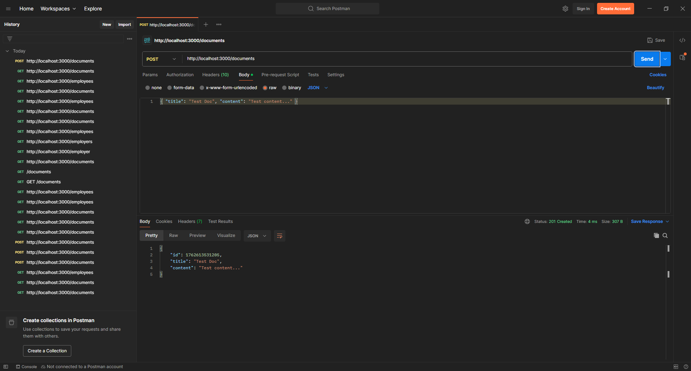
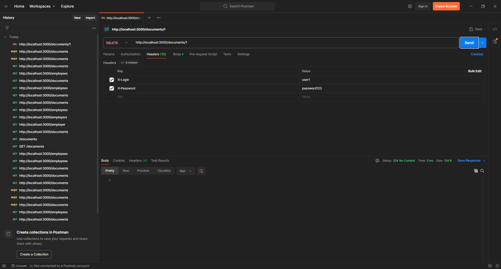

# Secure REST API - Лабораторна робота №3

Даний проєкт є виконанням лабораторної роботи №3, що демонструє розробку захищеного REST API на базі **Node.js** та **Express**.

Реалізовано API для базових CRUD-операцій з ресурсами. Впроваджено проміжні обробники (middleware) для вирішення наступних завдань:
* [cite_start]Логування вхідних запитів [cite: 432-434];
* [cite_start]Аутентифікація користувачів[cite: 399];
* [cite_start]Авторизація на основі ролей (Admin/User)[cite: 403].

## Встановлення та запуск

1.  **Клонування репозиторію:**
    ```bash
    git clone 
    cd secure-api-lab
    ```

2.  **Встановлення залежностей:**
    ```bash
    npm install
    ```
    [cite_start][cite: 513]

3.  **Запуск сервера:**
    ```bash
    npm start
    ```
    [cite_start][cite: 513]
    Сервер буде запущено на `http://localhost:3000`.

4.  **Запуск тестового клієнта (в окремому терміналі):**
    ```bash
    npm test
    ```
    [cite_start][cite: 514]

## Механізм Аутентифікації

[cite_start]Аутентифікація в API реалізована через передачу кастомних HTTP-заголовків[cite: 399]. Для доступу до захищених маршрутів необхідно надати:
* `X-Login`: логін користувача (напр., `user1` або `admin1`)
* `X-Password`: пароль користувача (напр., `password123`)

## Опис API (Endpoints)

[cite_start]Таблиця нижче описує всі реалізовані ендпоінти, необхідні рівні доступу та можливі коди відповіді [cite: 515-520].

| Метод | URL | Рівень доступу | Опис | Тіло запиту (Body) | Коди відповіді |
| :--- | :--- | :--- | :--- | :--- | :--- |
| `GET` | `/documents` | **User** | Отримує список всіх документів. | `(немає)` | `200`, `401` |
| `POST` | `/documents` | **User** | Створює новий документ. | `{ "title": "...", "content": "..." }` | `201`, `400`, `401` |
| `DELETE` | `/documents/:id` | **User** | Видаляє документ за `id`. | `(немає)` | `204`, `401`, `404` |
| `GET` | `/employees` | **Admin** | Отримує список співробітників. | `(немає)` | `200`, `401`, `403` |

## Демонстрація тестування (Postman)

[cite_start]Скріншоти, що демонструють тестування API за допомогою Postman[cite: 509].

---
### Сценарій: 401 Unauthorized (Спроба доступу без аутентифікації)


---
### Сценарій: 403 Forbidden (Користувач 'user' намагається отримати доступ до '/employees')


---
### Сценарій: 400 Bad Request (Створення документа без обов'язкового поля `title`)


---
### Сценарій: 404 Not Found (Спроба видалити неіснуючий документ)


---
### Сценарій: 200 OK (Користувач 'user' отримує `/documents`)


---
### Сценарій: 200 OK (Користувач 'admin' отримує `/employees`)


---
### Сценарій: 201 Created (Створення нового документа)


---
### Сценарій: 204 No Content (Успішне видалення документа)


## Посилання на репозиторій

 https://github.com/Slenderball/lab_3